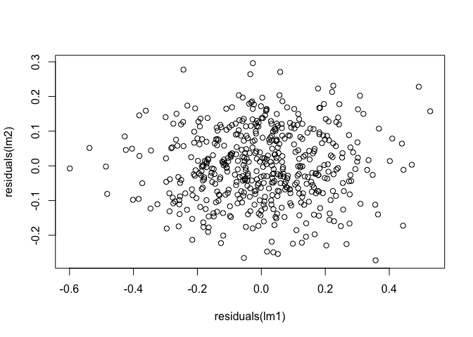
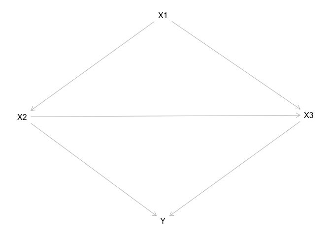

Causal inference workshop
================
James G. Hagan
2023-12-04

### Introduction

This tutorial is meant to introduce the basics of using causal inference
methodologies in your own research. First, you will learn how to play
around with the dagitty web tool that will allow you to create your own
Directed Acyclic Graphs (DAGs) (<https://dagitty.net/dags.html>).
Second, you will learn how to transfer your DAG into R. Third and
finally, you will learn how to analyse your DAG in R. By analysing your
DAG in R, you will be able to derive testable predictions to check
whether your DAG is consistent with the data. Moreover, through this
analysis, you will obtain information about the correct statistical
models to fit to obtain a given causal estimate. And, you will gain
information about how to interpret the coefficients obtained from any
given statistical model given the DAG.

### 1. Building DAGs using dagitty

In your web-browser, open the following link:

- <https://dagitty.net/dags.html>

In the top-left of the interface, click *Model* and then *New model*.
This will create a blank interface. To add a variable, simply click
anywhere in the space and it will ask you to give your variable a name.
I like to use abbreviations so, for example, if your variable is
rainfall, then I usually call it something like RF.

Once you have created your variables, you will need to specify how they
relate to one another. As Judea Pearl puts it, you will need to specify:
“who listens to who”. For this, you click on one variable (X1) and then
another variable (X2) and this creates an arrow going from X1 to X2. Do
this for all your variables.

Once you have constructed your DAG, you will see a box on the right-hand
side of the screen called: *Model code*. This is a set of instructions
that encodes your DAG that R can read. For a random model I created, the
code looks like this:

dag { bb=“0,0,1,1” X1 \[pos=“0.411,0.190”\] X2 \[pos=“0.355,0.314”\] X3
\[pos=“0.469,0.312”\] Y \[pos=“0.411,0.441”\] X1 -\> X2 X1 -\> X3 X2 -\>
X3 X2 -\> Y X3 -\> Y }

### 2. Importing DAGs into R using the dagitty R-package

There is an R-package called *dagitty* that interfaces with the
*dagitty* web-interface that we just used. So, first things first, you
will need to download the *dagitty* R-package. To do this, run the
following code:

``` r
# install.packages("dagitty")
library(dagitty)
```

Once the *dagitty* package is installed, we can use the model code from
the web interface to import our DAG into R. For this we do the following
and we call it *dag1*:

``` r
dag1 <- 
dagitty::dagitty(x = 'dag {
bb="0,0,1,1"
X1 [pos="0.411,0.190"]
X2 [pos="0.355,0.314"]
X3 [pos="0.469,0.312"]
Y [pos="0.411,0.441"]
X1 -> X2
X1 -> X3
X2 -> X3
X2 -> Y
X3 -> Y
}')
```

If we did this correctly, we can now plot our DAG in R using the
following code:

``` r
plot(dag1)
```

<!-- -->

### 3. Analysing DAGs using R and dagitty

Now that we have imported our DAG (i.e. *dag1*) into R, we can start to
analyse it. We will start by checking if our DAG is consistent with our
data.

**Is our DAG consistent with our data?**

The amazing thing about DAGs is that they make statements about
relationships in the actual data. So, once you have your data and you
have your DAG, you can check whether the statements the DAG makes about
the data are, in fact, true! This is a very powerful aspect of DAGs.

Of course, you have some real data that you have collected and you have
created a DAG to try and explain that data. The DAG I have just created
(i.e. *dag1*) is a hypothetical DAG. Therefore, there is no data to test
it against. But, I will simulate some data that matches the DAG and then
we can see how to test the DAG against data.

To simulate data that is consistent with the DAG, run the following
block of code:

``` r
# set the seed for reproducibility
set.seed(54908)

# set the number of data points to simulate
n <- 500

# simulate X1 as a normally distributed variable
x1 <- rnorm(n = n, mean = 20, sd = 3)

# simulate X2 as a variable that is caused by X1 with some random error
x2 <- (0.5*x1) + rnorm(n = n, mean = 0, sd = 0.1)

# simulate X3 as a variable that is caused by both X1 and X2 with some random error
x3 <- (-0.3*x1) + (1.2*x2) + rnorm(n = n, mean = 0, sd = 0.1)

# simulate Y as a variable that is caused by X2 and X3 with some random error
y <- (0.75*x2) + (1.5*x3) + rnorm(n = n, mean = 0, sd = 0.1)

# wrap all of this into a tibble (i.e. a fancy data.frame)
dag1_df <- dplyr::tibble(x1, x2, x3, y)
print(dag1_df)
```

    ## # A tibble: 500 × 4
    ##       x1    x2    x3     y
    ##    <dbl> <dbl> <dbl> <dbl>
    ##  1  18.9  9.29  5.61  15.4
    ##  2  18.9  9.33  5.54  15.3
    ##  3  22.1 11.0   6.70  18.3
    ##  4  20.2 10.1   6.04  16.6
    ##  5  18.4  9.25  5.51  15.1
    ##  6  19.9 10.0   5.94  16.4
    ##  7  23.4 11.8   7.12  19.7
    ##  8  18.2  9.07  5.42  14.8
    ##  9  14.2  7.13  4.21  11.8
    ## 10  19.9 10.0   6.08  16.7
    ## # ℹ 490 more rows

First, we can use the *dagitty* R-package to see what kind of statements
the DAG implies about the data. To do this, we run the following code:

``` r
# put our dag into the function
dagitty::impliedConditionalIndependencies(x = dag1)
```

    ## X1 _||_ Y | X2, X3

How do we read such gibberish? This weird symbol **\|\|** means “is
independent of”. And, just like in probability theory, the symbol *\|*
means “given” or “conditional on” and the comma *,* means “and”. So we
can read this statement as:

- “X1 is independent of Y given X2 and X3”.

In simple terms, what this means is that X1 and Y should be
*uncorrelated* if we condition on X2 and X3 i.e. we add X2 and X3 into
our statistical model as covariates.

There are many different ways to test such *conditional independence*
statements. For example, we can fit general linear models to X1 and Y
with X2 and X3 as predictor variables and then see if the residuals are
correlated. To do this, run the following block of code:

``` r
# fit a linear model to X1 with X2 and X3 as predictor variables
lm1 <- lm(x1 ~ x2 + x3, data = dag1_df)

# fit a linear model to Y with X2 and X3 as predictor variables
lm2 <- lm(y ~ x2 + x3, data = dag1_df)

# plot the relationship with the residuals
plot(residuals(lm1), residuals(lm2))
```

<!-- -->

``` r
# check if the residuals are correlated
cor.test(x = residuals(lm1), y = residuals(lm2))
```

    ## 
    ##  Pearson's product-moment correlation
    ## 
    ## data:  residuals(lm1) and residuals(lm2)
    ## t = 0.81379, df = 498, p-value = 0.4162
    ## alternative hypothesis: true correlation is not equal to 0
    ## 95 percent confidence interval:
    ##  -0.05141251  0.12373754
    ## sample estimates:
    ##        cor 
    ## 0.03644238

As you can see, the residuals are unrelated and the correlation between
the residuals is non-significant. We know this is the case in this
example because of how we simulated the DAG.

Another option is to use analysis of variance techniques
(e.g. Schoolmaster et al. 2020) or the equivalent likelihood ratio tests
for models with non-normal error distributions. For example, we fit a
linear model to Y with X2 and X3 as predictor variables. We then fit
another linear model to Y with X1, X2 and X3 as predictor variables. We
then test if the more complex model (i.e. with X1, X2 and X3 as
predictor variables) explains more variance than the simpler model
(i.e. with only X2 and X3 as predictor variables):

``` r
# fit a linear model to Y with X2 and X3 as predictor variables
lm1 <- lm(y ~ x2 + x3, data = dag1_df)

# fit a linear model to Y with X1, X2 and X3 as predictor variables
lm2 <- lm(y ~ x1 + x2 + x3, data = dag1_df)

# compare the models using analysis of variance
anova(lm1, lm2)
```

    ## Analysis of Variance Table
    ## 
    ## Model 1: y ~ x2 + x3
    ## Model 2: y ~ x1 + x2 + x3
    ##   Res.Df    RSS Df Sum of Sq      F Pr(>F)
    ## 1    497 5.4173                           
    ## 2    496 5.4101  1 0.0071945 0.6596 0.4171

As you can see, the complicated model is not significantly different
from the simpler model which, in this case, means that X1 and Y are
independent given X2 and X3.

However, there are a number of specialised R-packages that will conduct
these kinds of tests for you. One of the common R-packages for doing
this is called *bnlearn*. To install and load this package, run the
following code block:

``` r
# install.packages("bnlearn")
library(bnlearn)
```

    ## 
    ## Attaching package: 'bnlearn'

    ## The following objects are masked from 'package:dagitty':
    ## 
    ##     ancestors, children, descendants, parents, spouses

Using this package, we can use the *ci.test* function to perform these
conditional independence tests and check if our DAG is consistent with
the data. Remember, the conditional independence statement that we are
trying to test is:

- “X1 is independent of Y given X2 and X3”.

Here, X1 is the x-variable, Y is the y variable and the variables X2 and
X3 are covariates. To see how this works for this example, run the
following code block:

``` r
# x = the x variable (i.e. x1 in this example)
# y = the y variable (i.e. y in this example)
# z = the covariates (i.e. x2 and x3 in this example)
bnlearn::ci.test(x = "x1", y = "y", z = c("x2", "x3"), data = dag1_df, test = "cor")
```

    ## 
    ##  Pearson's Correlation
    ## 
    ## data:  x1 ~ y | x2 + x3
    ## cor = 0.036442, df = 496, p-value = 0.4171
    ## alternative hypothesis: true value is not equal to 0

As you may have noticed, this is the same result that we got by
correlating the residuals of X1 and Y from models with X2 and X3 as
predictor variables (see previous examples). This is because we told
*ci.test* to implement the Pearson’s correlation test (test = “cor”).
However, the *ci.test* function has many other possible tests which can
be useful when, for example, some of your data are categorical.

How should we interpret this non-significant test result? What it means
is that, with our current dataset, our data are consistent with the DAG.
This is because the DAG told us that X1 and Y should be independent of
one another if we conditioned on X2 and X3. We then tested this
statement and found that, indeed, X1 and Y are independent in the data
when we condition on X2 and X3.

Of course, this does not mean that our DAG is true. We could create
other DAGs that generate different conditional independence statements
and our data might be consistent with those as well. Moreover, we might
have low quality data which prevents us from accurately testing these
conditional independence statements. However, combined with the
scientific logic we used to construct the DAG, the fact that our data
are at least consistent with DAG gives us reassurance that the DAG will
be useful for informing our statistical analyses.

If your data are not consistent with the data, then you should go back
to the drawing board and try to figure out why. Perhaps there is some
important unmeasured variable or perhaps your understanding of the
system is wrong. Usually, building the DAG, testing it against data and
then trying new DAGs can tell you a lot about the system and whether
your understanding of it is correct.

**How do we use the DAG to design appropriate statistical procedures?**

Okay, so now we have a DAG that is consistent with the data. The next
step is ask the DAG how to create statistical models to estimate various
relevant causal effects.

First, let’s just look at the DAG again:

``` r
plot(dag1)
```

<!-- -->

Now, let’s imagine that we want to estimate the *direct* causal effect
of X2 on Y. Therefore, in the DAG above, we want to estimate the effect
associated with the arrow going from X2 to Y.

What kind of statistical model should we use to estimate this effect?
Which variables should we include? Of course, we know we have to include
X2 and Y but then what? Should we include X1 or X3? Should we include
both?

We can use the DAG to answer these questions. To do this, we can use the
*adjustmentSets* function from the dagitty R-package. To do this, we
have to add in the following information into the function:

- x - our DAG (i.e. dag1 in this example)
- exposure - the exposure variable which, in this case, is X2
- outcome - the outcome variable which, in this case, is Y
- effect - in this case, we want the direct effect (I will explain the
  total effect later)

We can fill this information into the function below:

``` r
# ask the DAG how to estimate the direct causal effect of X2 on Y
dagitty::adjustmentSets(x = dag1,
                        exposure = "X2", 
                        outcome = "Y",
                        effect = "direct")
```

    ## { X3 }

The output that this bit of code gives is “{ X3 }”. Basically, this
means that, to estimate the causal effect of X2 on Y, we need to adjust
for or condition on X3 i.e. we need to add X3 into our model as a
covariate.

Basically, we fit a linear model with Y as the response variable and X2
and X3 as predictor variables. The coefficient associated with the
effect of X2 on Y is then the estimate for the direct causal effect of
X2 on Y.

``` r
lm1 <- lm(y ~ x2 + x3, data = dag1_df)
summary(lm1)
```

    ## 
    ## Call:
    ## lm(formula = y ~ x2 + x3, data = dag1_df)
    ## 
    ## Residuals:
    ##       Min        1Q    Median        3Q       Max 
    ## -0.272508 -0.073107 -0.003364  0.076576  0.296068 
    ## 
    ## Coefficients:
    ##             Estimate Std. Error t value Pr(>|t|)    
    ## (Intercept)  0.01997    0.03153   0.633    0.527    
    ## x2           0.73065    0.02454  29.768   <2e-16 ***
    ## x3           1.52923    0.03996  38.269   <2e-16 ***
    ## ---
    ## Signif. codes:  0 '***' 0.001 '**' 0.01 '*' 0.05 '.' 0.1 ' ' 1
    ## 
    ## Residual standard error: 0.1044 on 497 degrees of freedom
    ## Multiple R-squared:  0.9983, Adjusted R-squared:  0.9983 
    ## F-statistic: 1.454e+05 on 2 and 497 DF,  p-value: < 2.2e-16

As you can see from the model output, the causal effect of X2 on Y is
given as 0.73. This means that for every one unit of increase of X2, Y
increases by 0.73 units. Because we simulated this DAG, we can see if
this matches the true effect i.e. the effect that simulated. And, yes,
it does. In the simulation, I specified that the true causal effect of
X2 on Y was 0.75!

What would’ve happened if we had just used all the variables as is
common? Let’s see!

``` r
lm1 <- lm(y ~ x1 + x2 + x3, data = dag1_df)
summary(lm1)
```

    ## 
    ## Call:
    ## lm(formula = y ~ x1 + x2 + x3, data = dag1_df)
    ## 
    ## Residuals:
    ##       Min        1Q    Median        3Q       Max 
    ## -0.280208 -0.073278 -0.003396  0.077144  0.296641 
    ## 
    ## Coefficients:
    ##             Estimate Std. Error t value Pr(>|t|)    
    ## (Intercept)  0.01870    0.03157   0.592    0.554    
    ## x1           0.02155    0.02653   0.812    0.417    
    ## x2           0.67614    0.07147   9.460   <2e-16 ***
    ## x3           1.54850    0.04649  33.312   <2e-16 ***
    ## ---
    ## Signif. codes:  0 '***' 0.001 '**' 0.01 '*' 0.05 '.' 0.1 ' ' 1
    ## 
    ## Residual standard error: 0.1044 on 496 degrees of freedom
    ## Multiple R-squared:  0.9983, Adjusted R-squared:  0.9983 
    ## F-statistic: 9.69e+04 on 3 and 496 DF,  p-value: < 2.2e-16

From this output with a mis-specified model, the causal effect we get
for the effect of X2 on Y is 0.68. This is less accurate than the model
that the DAG told us to fit.

What about if we wanted to estimate the direct causal effect of X3 on Y?
What kind of statistical model would we need then? Try figure this out
using some of the code above.

Then using this information, fit a model and try to estimate the direct
causal effect of X3 on Y. I will tell you that the true direct causal
effect of X3 on Y that I simulated is:

- 1.5

What these examples are meant to illustrate is that the DAG can help you
decide what kinds of model to fit when you want to estimate a specific
causal effect. It also means that you should not just interpret big
tables full of regression coefficients. Rather, you should fit specific
statistical models for each causal effect that you want to estimate.

**What is the difference between direct and total causal effects?**

In these previous examples, the causal effects that we estimated were
all *direct causal effects*. But what exactly is a *direct causal
effect* and how is it different to a *total causal effect*?

To explain this, let’s have a look at the DAG again:

``` r
plot(dag1)
```

<!-- -->

If you look at the variable X2, it directly affects Y because there is
an arrow going directly from X2 to Y. However, X2 also directly affects
X3 and there is a direct arrow going from X3 to Y. Therefore, X2 also
affects Y because it affects X3. Therefore, the total effect of X2 on Y
is the combined effect of:

- The direct effect of X2 on Y
- The indirect effect of X2 on Y that acts through X3

We can also estimate the total effect of X2 on Y but, to do so, we need
to ask the DAG what kind of statistical model to fit. So let’s do this.
We will again use the *adjustmentSets* function but now, instead of
saying:

- effect = “direct”

We will specify:

- effect = “total”

``` r
# ask the DAG how to estimate the total causal effect of X2 on Y
dagitty::adjustmentSets(x = dag1,
                        exposure = "X2", 
                        outcome = "Y",
                        effect = "total")
```

    ## { X1 }

Now, instead of including X3 as a covariate, we need to include X1 as a
covariate in our statistical model. So, let’s fit this model and check
out the estimated effect:

``` r
lm1 <- lm(y ~ x2 + x1, data = dag1_df)
summary(lm1)
```

    ## 
    ## Call:
    ## lm(formula = y ~ x2 + x1, data = dag1_df)
    ## 
    ## Residuals:
    ##      Min       1Q   Median       3Q      Max 
    ## -0.48633 -0.11927 -0.00552  0.12544  0.61846 
    ## 
    ## Coefficients:
    ##             Estimate Std. Error t value Pr(>|t|)    
    ## (Intercept) -0.06048    0.05659  -1.069    0.286    
    ## x2           2.51518    0.08159  30.828   <2e-16 ***
    ## x1          -0.42964    0.04101 -10.476   <2e-16 ***
    ## ---
    ## Signif. codes:  0 '***' 0.001 '**' 0.01 '*' 0.05 '.' 0.1 ' ' 1
    ## 
    ## Residual standard error: 0.1877 on 497 degrees of freedom
    ## Multiple R-squared:  0.9945, Adjusted R-squared:  0.9945 
    ## F-statistic: 4.482e+04 on 2 and 497 DF,  p-value: < 2.2e-16

If you remember, the direct effect of X2 on Y was 0.73. Now, however,
the total effect of X2 on Y is much stronger. It is now: 2.5!

Why does this occur? Well, it occurs because when I simulated these
data, I specified that X2 as a positive direct effect on X3 of 1.2 and
that X3 has a positive direct effect on Y of 1.5. Therefore, the path
connecting X2 and Y that goes through X3 has an effect of 1.8 i.e. for
every one unit increase of X2, Y increases by 1.8 (multiply 1.2 by 1.5).
Then, the direct effect of X2 on Y is 0.75. So, if we add up 0.75 and
1.8, we get a true, simulated total causal effect of X2 on Y of 2.55.
And, the model estimated this total causal effect to be 2.52.

So, direct and total causal effects are both valid and interesting.
Deciding which one to use will depend on the question you are trying to
answer.

### Conclusions

That’s a very brief introduction to using DAGs to design statistical
procedures to estimate causal effects from data. I hope it was useful
and I really encourage you to try and think about DAGs that make sense
for your data and to use these methods to help you design your
statistical models.
