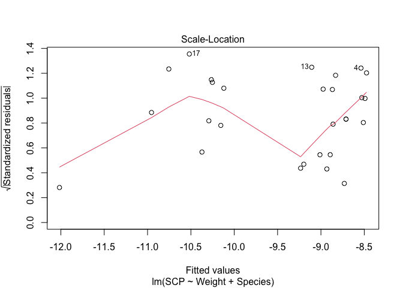

Causal inference workshop
================
James G. Hagan
2024-01-03

### Introduction

The lecture provided the theoretical background of causal inference.
This tutorial is meant to introduce the basics of using causal inference
methodologies for use in your own research. First, we will learn how to
play around with the dagitty web tool that will allow us to create our
own Directed Acyclic Graphs (DAGs) (<https://dagitty.net/dags.html>).
Second, we will learn how to transfer our DAGs into R. Third, we will
learn how to analyse our DAG in R. By analysing our DAG in R, we will be
able to derive testable predictions to check whether our DAG is
consistent with the data. Moreover, through this analysis, we will
obtain information about the correct statistical models to fit to obtain
a given causal estimate. And, we will gain information about how to
interpret the coefficients obtained from any given statistical model
given the DAG.

Finally, we will analyse an example dataset of seaweed fly supercooling
points.

### 1. Building DAGs using dagitty

In your web-browser, open the following link:

- <https://dagitty.net/dags.html>

In the top-left of the interface, click *Model* and then *New model*.
This will create a blank interface. To add a variable, simply click
anywhere in the space and it will ask you to give your variable a name.
I like to use abbreviations so, for example, if your variable is
rainfall, then I usually call it something like RF.

Once you have created your variables, you will need to specify how they
relate to one another. As Judea Pearl (one of the father’s of modern
causal inference) puts it, you will need to specify: “who listens to
who”. For this, you click on one variable (X1) and then another variable
(X2) and this creates an arrow going from X1 to X2. Do this for all your
variables.

Once you have constructed your DAG, you will see a box on the right-hand
side of the screen called: *Model code*. This is a set of instructions
that encodes your DAG that R can read. For the random model that I
created, the code looks like this:

dag { bb=“0,0,1,1” X1 \[pos=“0.411,0.190”\] X2 \[pos=“0.355,0.314”\] X3
\[pos=“0.469,0.312”\] Y \[pos=“0.411,0.441”\] X1 -\> X2 X1 -\> X3 X2 -\>
X3 X2 -\> Y X3 -\> Y }

### 2. Importing DAGs into R using the dagitty R-package

There is an R-package called *dagitty* that interfaces with the
*dagitty* web-interface that we just used. So, first things first, you
will need to download the *dagitty* R-package. To do this, run the
following code:

``` r
# if dagitty is not installed then install it using install.packages()
if( !("dagitty" %in% installed.packages()[,1]) ) install.packages("dagitty")

# load the dagitty package
library(dagitty)
```

Once the *dagitty* package is installed and loaded, we can use the model
code from the web interface to import our DAG into R. For this we do the
following and we call it *dag1*:

``` r
dag1 <- 
dagitty::dagitty(x = 'dag {
bb="0,0,1,1"
X1 [pos="0.411,0.190"]
X2 [pos="0.355,0.314"]
X3 [pos="0.469,0.312"]
Y [pos="0.411,0.441"]
X1 -> X2
X1 -> X3
X2 -> X3
X2 -> Y
X3 -> Y
}')
```

If we did this correctly, we can now plot our DAG in R using the
following code:

``` r
plot(dag1)
```

<!-- -->

What this DAG says is that X1 affects both X2 and X3, that X2 affects X3
and that X2 and X3 both affect Y. Notice, therefore, that X1 does not
directly affect Y but will have an influence on Y because of how it
affects X2 and X3. Does this make sense? Just follow the arrows and it
will become clear.

### 3. Analysing DAGs using R and dagitty

Now that we have imported our DAG (i.e. *dag1*) into R, we can start to
analyse it. We will start by checking if our DAG is consistent with our
data.

**Is our DAG consistent with our data?**

The amazing thing about DAGs is that they make statements about
relationships in the actual data. So, once we have our data and we have
our DAG, we can check whether the statements the DAG makes about the
data are, in fact, true! This is a very powerful aspect of DAGs.

Of course, usually, we will have some real data that we have collected
and we have then created a DAG to try and explain that data. The DAG we
have just created (i.e. *dag1*) is a hypothetical DAG. Therefore, there
is no data to test it against. But, we will simulate some data that
matches the DAG and then we can see how to test the DAG against data.

To simulate data that is consistent with the DAG, run the following
block of code. The details of this code are not very important to
understand but, in brief, I am simply simulating variables as linear
functions of other variables along with some random error:

``` r
# set the seed for reproducibility
set.seed(54908)

# set the number of data points to simulate
n <- 500

# simulate X1 as a normally distributed variable
x1 <- rnorm(n = n, mean = 20, sd = 3)

# simulate X2 as a variable that is caused by X1 with some random error
x2 <- (0.5*x1) + rnorm(n = n, mean = 0, sd = 0.1)

# simulate X3 as a variable that is caused by both X1 and X2 with some random error
x3 <- (-0.3*x1) + (1.2*x2) + rnorm(n = n, mean = 0, sd = 0.1)

# simulate Y as a variable that is caused by X2 and X3 with some random error
y <- (0.75*x2) + (1.5*x3) + rnorm(n = n, mean = 0, sd = 0.1)

# wrap all of this into a tibble (i.e. a fancy data.frame)
dag1_df <- dplyr::tibble(x1, x2, x3, y)
print(dag1_df)
```

    ## # A tibble: 500 × 4
    ##       x1    x2    x3     y
    ##    <dbl> <dbl> <dbl> <dbl>
    ##  1  18.9  9.29  5.61  15.4
    ##  2  18.9  9.33  5.54  15.3
    ##  3  22.1 11.0   6.70  18.3
    ##  4  20.2 10.1   6.04  16.6
    ##  5  18.4  9.25  5.51  15.1
    ##  6  19.9 10.0   5.94  16.4
    ##  7  23.4 11.8   7.12  19.7
    ##  8  18.2  9.07  5.42  14.8
    ##  9  14.2  7.13  4.21  11.8
    ## 10  19.9 10.0   6.08  16.7
    ## # ℹ 490 more rows

So, now we have our data. Now, we can use the *dagitty* R-package to see
what kind of statements the DAG implies about this data. To do this, we
run the following code:

``` r
# put our dag into the function
dagitty::impliedConditionalIndependencies(x = dag1)
```

    ## X1 _||_ Y | X2, X3

How do we read such gibberish? This weird symbol **\|\|** means “is
independent of”. And, just like in probability theory, the symbol *\|*
means “given” or “conditional on” and the comma *,* means “and”. So we
can read this statement as:

- “X1 is independent of Y given X2 and X3”.

In simple terms, what this means is that X1 and Y should be
*uncorrelated* if we condition on X2 and X3 i.e. we add X2 and X3 into
our statistical model as covariates. So, with nothing but a DAG, we can
get information about what the data should look like if it were
consistent with the causal structure encoded in the DAG. Pretty amazing
if you ask me.

So, how do we test for this in the data? There are many different ways
to test this *conditional independence* statement. One way is to a fit
general linear model to X1 and Y with X2 and X3 as predictor variables
and then see if the residuals are correlated. To do this, run the
following block of code:

``` r
# fit a linear model to X1 with X2 and X3 as predictor variables
lm1 <- lm(x1 ~ x2 + x3, data = dag1_df)

# fit a linear model to Y with X2 and X3 as predictor variables
lm2 <- lm(y ~ x2 + x3, data = dag1_df)

# plot the relationship with the residuals
plot(residuals(lm1), residuals(lm2))
```

<!-- -->

``` r
# check if the residuals are correlated
cor.test(x = residuals(lm1), y = residuals(lm2))
```

    ## 
    ##  Pearson's product-moment correlation
    ## 
    ## data:  residuals(lm1) and residuals(lm2)
    ## t = 0.81379, df = 498, p-value = 0.4162
    ## alternative hypothesis: true correlation is not equal to 0
    ## 95 percent confidence interval:
    ##  -0.05141251  0.12373754
    ## sample estimates:
    ##        cor 
    ## 0.03644238

As you can see, the residuals are visually unrelated and the correlation
between the residuals is small and non-significant. Therefore, in this
case, the data are consistent with the DAG because the DAG told us that
“X1 should be independent of Y given X2 and X3” which is what we found.
Of course, we simulated data that is consistent with this DAG so it is
not surprising but it’s always nice when things work out as they should.

Another option for testing conditional independence statements is to use
analysis of variance techniques (e.g. Schoolmaster et al. 2020) or the
equivalent likelihood ratio tests for models with non-normal error
distributions. For example, we fit a linear model to Y with X2 and X3 as
predictor variables. We then fit another linear model to Y with X1, X2
and X3 as predictor variables. We then test if the more complex model
(i.e. with X1, X2 and X3 as predictor variables) explains more variance
than the simpler model (i.e. with only X2 and X3 as predictor
variables):

``` r
# fit a linear model to Y with X2 and X3 as predictor variables
lm1 <- lm(y ~ x2 + x3, data = dag1_df)

# fit a linear model to Y with X1, X2 and X3 as predictor variables
lm2 <- lm(y ~ x1 + x2 + x3, data = dag1_df)

# compare the models using analysis of variance
anova(lm1, lm2)
```

    ## Analysis of Variance Table
    ## 
    ## Model 1: y ~ x2 + x3
    ## Model 2: y ~ x1 + x2 + x3
    ##   Res.Df    RSS Df Sum of Sq      F Pr(>F)
    ## 1    497 5.4173                           
    ## 2    496 5.4101  1 0.0071945 0.6596 0.4171

As we can see, the complicated model is not significantly different from
the simpler model which, in this case, means that X1 and Y are
independent given X2 and X3.

However, there are a number of specialised R-packages that will conduct
these kinds of tests for us. One of the common R-packages for doing this
is called *bnlearn*. To install and load this package, run the following
code block:

``` r
# if dagitty is not installed then install it using install.packages()
if( !("bnlearn" %in% installed.packages()[,1]) ) install.packages("bnlearn")

# load the bnlearn package
library(bnlearn)
```

    ## 
    ## Attaching package: 'bnlearn'

    ## The following objects are masked from 'package:dagitty':
    ## 
    ##     ancestors, children, descendants, parents, spouses

Using this package, we can use the *ci.test* function to perform these
conditional independence tests and check if our DAG is consistent with
the data. Remember, the conditional independence statement that we are
trying to test is:

- “X1 is independent of Y given X2 and X3”.

Here, X1 is the x-variable, Y is the y variable and the variables X2 and
X3 are covariates. To see how this works for this example, run the
following code block:

``` r
# x = the x variable (i.e. x1 in this example)
# y = the y variable (i.e. y in this example)
# z = the covariates (i.e. x2 and x3 in this example)
bnlearn::ci.test(x = "x1", y = "y", z = c("x2", "x3"), data = dag1_df, test = "cor")
```

    ## 
    ##  Pearson's Correlation
    ## 
    ## data:  x1 ~ y | x2 + x3
    ## cor = 0.036442, df = 496, p-value = 0.4171
    ## alternative hypothesis: true value is not equal to 0

As you may have noticed, this is the same result that we got by
correlating the residuals of X1 and Y from models with X2 and X3 as
predictor variables (see previous examples). This is because we told
*ci.test* to implement the Pearson’s correlation test (test = “cor”).
However, the *ci.test* function has many other possible tests which can
be useful when, for example, some of your data are categorical.

Just to recap how we should interpret this non-significant test result?
What this result means is that, with our current dataset, our data are
consistent with the DAG. This is because the DAG told us that X1 and Y
should be independent of one another if we conditioned on X2 and X3. We
then tested this statement and found that, indeed, X1 and Y are
independent in the data when we condition on X2 and X3.

Of course, this does not mean that our DAG is true. We could create
other DAGs that generate different conditional independence statements
and our data might be consistent with those as well. Moreover, we might
have low quality data which prevents us from accurately testing these
conditional independence statements. However, combined with the
scientific logic we used to construct the DAG, the fact that our data
are at least consistent with DAG gives us reassurance that the DAG will
be useful for informing our statistical analyses.

If your data are not consistent with the data, then you should go back
to the drawing board and try to figure out why. Perhaps there is some
important unmeasured variable or perhaps your understanding of the
system is wrong. Usually, building the DAG, testing it against data and
then trying new DAGs can tell you a lot about the system and whether
your understanding of it is correct.

**How do we use the DAG to design appropriate statistical procedures?**

Okay, so now we have a DAG that is consistent with the data. The next
step is ask the DAG how to create statistical models to estimate various
relevant causal effects.

First, let’s just look at the DAG again:

``` r
plot(dag1)
```

<!-- -->

Now, let’s imagine that we want to estimate the *direct* causal effect
of X2 on Y. Therefore, in the DAG above, we want to estimate the effect
associated with the arrow going from X2 to Y.

What kind of statistical model should we use to estimate this effect?
Which variables should we include? Of course, we know we have to include
X2 and Y but then what? Should we include X1 or X3? Should we include
both?

We can use the DAG to answer these questions. To do this, we can use the
*adjustmentSets* function from the dagitty R-package. To do this, we
have to add in the following information into the function:

- x - our DAG (i.e. dag1 in this example)
- exposure - the exposure variable which, in this case, is X2
- outcome - the outcome variable which, in this case, is Y
- effect - in this case, we want the direct effect (I will explain the
  total effect later)

We can fill this information into the function below:

``` r
# ask the DAG how to estimate the direct causal effect of X2 on Y
dagitty::adjustmentSets(x = dag1,
                        exposure = "X2", 
                        outcome = "Y",
                        effect = "direct")
```

    ## { X3 }

The output that this bit of code gives is “{ X3 }”. Basically, this
means that, to estimate the causal effect of X2 on Y, we need to adjust
for or condition on X3 i.e. we need to add X3 into our model as a
covariate.

Basically, we fit a linear model with Y as the response variable and X2
and X3 as predictor variables. The coefficient associated with the
effect of X2 on Y is then the estimate for the direct causal effect of
X2 on Y.

``` r
lm1 <- lm(y ~ x2 + x3, data = dag1_df)
summary(lm1)
```

    ## 
    ## Call:
    ## lm(formula = y ~ x2 + x3, data = dag1_df)
    ## 
    ## Residuals:
    ##       Min        1Q    Median        3Q       Max 
    ## -0.272508 -0.073107 -0.003364  0.076576  0.296068 
    ## 
    ## Coefficients:
    ##             Estimate Std. Error t value Pr(>|t|)    
    ## (Intercept)  0.01997    0.03153   0.633    0.527    
    ## x2           0.73065    0.02454  29.768   <2e-16 ***
    ## x3           1.52923    0.03996  38.269   <2e-16 ***
    ## ---
    ## Signif. codes:  0 '***' 0.001 '**' 0.01 '*' 0.05 '.' 0.1 ' ' 1
    ## 
    ## Residual standard error: 0.1044 on 497 degrees of freedom
    ## Multiple R-squared:  0.9983, Adjusted R-squared:  0.9983 
    ## F-statistic: 1.454e+05 on 2 and 497 DF,  p-value: < 2.2e-16

As you can see from the model output, the causal effect of X2 on Y is
given as 0.73. This means that for every one unit of increase of X2, Y
increases by 0.73 units. Because we simulated this DAG, we can see if
this matches the true effect i.e. the effect that simulated. And, yes,
it does. In the simulation, I specified that the true causal effect of
X2 on Y was 0.75!

What would’ve happened if we had just used all the variables as is
common? Let’s see!

``` r
lm1 <- lm(y ~ x1 + x2 + x3, data = dag1_df)
summary(lm1)
```

    ## 
    ## Call:
    ## lm(formula = y ~ x1 + x2 + x3, data = dag1_df)
    ## 
    ## Residuals:
    ##       Min        1Q    Median        3Q       Max 
    ## -0.280208 -0.073278 -0.003396  0.077144  0.296641 
    ## 
    ## Coefficients:
    ##             Estimate Std. Error t value Pr(>|t|)    
    ## (Intercept)  0.01870    0.03157   0.592    0.554    
    ## x1           0.02155    0.02653   0.812    0.417    
    ## x2           0.67614    0.07147   9.460   <2e-16 ***
    ## x3           1.54850    0.04649  33.312   <2e-16 ***
    ## ---
    ## Signif. codes:  0 '***' 0.001 '**' 0.01 '*' 0.05 '.' 0.1 ' ' 1
    ## 
    ## Residual standard error: 0.1044 on 496 degrees of freedom
    ## Multiple R-squared:  0.9983, Adjusted R-squared:  0.9983 
    ## F-statistic: 9.69e+04 on 3 and 496 DF,  p-value: < 2.2e-16

From this output with a mis-specified model, the causal effect we get
for the effect of X2 on Y is 0.68. This is less accurate than the model
that the DAG told us to fit.

What about if we wanted to estimate the direct causal effect of X3 on Y?
What kind of statistical model would we need then? Try figure this out
using some of the code above.

Then using this information, fit a model and try to estimate the direct
causal effect of X3 on Y. I will tell you that the true direct causal
effect of X3 on Y that I simulated is:

- 1.5

What these examples are meant to illustrate is that the DAG can help you
decide what kinds of model to fit when you want to estimate a specific
causal effect. It also means that you should not just interpret big
tables full of regression coefficients. Rather, you should fit specific
statistical models for each causal effect that you want to estimate.

**What is the difference between direct and total causal effects?**

In these previous examples, the causal effects that we estimated were
all *direct causal effects*. But what exactly is a *direct causal
effect* and how is it different to a *total causal effect*?

To explain this, let’s have a look at the DAG again:

``` r
plot(dag1)
```

<!-- -->

If you look at the variable X2, it directly affects Y because there is
an arrow going directly from X2 to Y. However, X2 also directly affects
X3 and there is a direct arrow going from X3 to Y. Therefore, X2 also
affects Y indirectly because it affects X3. Therefore, the total effect
of X2 on Y is the combined effect of:

- The direct effect of X2 on Y
- The indirect effect of X2 on Y that acts through X3

We can also estimate the total effect of X2 on Y but, to do so, we need
to ask the DAG what kind of statistical model to fit. So let’s do this.
We will again use the *adjustmentSets* function but now, instead of
saying:

- effect = “direct”

We will specify:

- effect = “total”

``` r
# ask the DAG how to estimate the total causal effect of X2 on Y
dagitty::adjustmentSets(x = dag1,
                        exposure = "X2", 
                        outcome = "Y",
                        effect = "total")
```

    ## { X1 }

Now, instead of including X3 as a covariate, we need to include X1 as a
covariate in our statistical model. So, let’s fit this model and check
out the estimated effect:

``` r
lm1 <- lm(y ~ x2 + x1, data = dag1_df)
summary(lm1)
```

    ## 
    ## Call:
    ## lm(formula = y ~ x2 + x1, data = dag1_df)
    ## 
    ## Residuals:
    ##      Min       1Q   Median       3Q      Max 
    ## -0.48633 -0.11927 -0.00552  0.12544  0.61846 
    ## 
    ## Coefficients:
    ##             Estimate Std. Error t value Pr(>|t|)    
    ## (Intercept) -0.06048    0.05659  -1.069    0.286    
    ## x2           2.51518    0.08159  30.828   <2e-16 ***
    ## x1          -0.42964    0.04101 -10.476   <2e-16 ***
    ## ---
    ## Signif. codes:  0 '***' 0.001 '**' 0.01 '*' 0.05 '.' 0.1 ' ' 1
    ## 
    ## Residual standard error: 0.1877 on 497 degrees of freedom
    ## Multiple R-squared:  0.9945, Adjusted R-squared:  0.9945 
    ## F-statistic: 4.482e+04 on 2 and 497 DF,  p-value: < 2.2e-16

If you remember, the direct effect of X2 on Y was 0.73. Now, however,
the total effect of X2 on Y is much stronger. It is now: 2.5!

Why does this occur? Well, it occurs because when I simulated these
data, I specified that X2 as a positive direct effect on X3 of 1.2 and
that X3 has a positive direct effect on Y of 1.5. Therefore, the path
connecting X2 and Y that goes through X3 has an effect of 1.8 i.e. for
every one unit increase of X2, Y increases by 1.8 (multiply 1.2 by 1.5).
Then, the direct effect of X2 on Y is 0.75. So, if we add up 0.75 and
1.8, we get a true, simulated total causal effect of X2 on Y of 2.55.
And, the model estimated this total causal effect to be 2.52.

So, direct and total causal effects are both valid and interesting.
Deciding which one to use will depend on the question you are trying to
answer.

### Example dataset: Supercooling points in coexisting seaweed flies

To illustrate how using causal inference methodologies can help us
answer complex research questions, we will look at two seaweed fly
species: *Coleopa frigida* and *Coleopa pilipes*. These species often
coexist in the brown algae wrack beds that wash up on seashores
throughout Europe, using these beds as both habitats and food sources.
However, although they exist in sympatry across much of Northern Europe,
*C. pilipes* occurs at lower latitudes in the south and *C. frigida*
occurs at higher latitudes in the north. Therefore, it seems reasonable
to expect that *C. frigida* would have a higher cold tolerance than *C.
pilipes*. However, this has not been properly tested.

We will analyse a dataset where the supercooling points of both species
were measured on coexisting populations from the west coast of Sweden.
What is the supercooling point? The supercooling point is the
temperature at which ice-formation starts occurring in an animal’s body.
Many insects accumulate certain types of sugars and other compounds to
reduce their supercooling point to well-below freezing. Thus, species
with good cold tolerance are expected to have lower supercooling points.
In this study, the supercooling point was measured using a thermocouple.
In addition, the sex and weight (g) of each individual was measured.

Let’s now load the data and see what it looks like:

``` r
# load the seaweed fly data from github
fly_dat <- readr::read_csv(url("https://raw.githubusercontent.com/haganjam/Rworkshops/main/03-causal-inference/data/seaweed-flies.csv"))
```

    ## Rows: 36 Columns: 6
    ## ── Column specification ────────────────────────────────────────────────────────
    ## Delimiter: ","
    ## chr (2): Sex, Species
    ## dbl (4): Experiment, SCP, SCP_ID, Weight
    ## 
    ## ℹ Use `spec()` to retrieve the full column specification for this data.
    ## ℹ Specify the column types or set `show_col_types = FALSE` to quiet this message.

``` r
# check the first few rows of data
head(fly_dat)
```

    ## # A tibble: 6 × 6
    ##   Experiment Sex     SCP SCP_ID Species Weight
    ##        <dbl> <chr> <dbl>  <dbl> <chr>    <dbl>
    ## 1          1 male   -7.1   1602 P         4.78
    ## 2          1 male   -6.2   1480 P         3.65
    ## 3          1 male   -8.5   1796 P         4.88
    ## 4          1 male  -12.1   2220 P         3.89
    ## 5          1 male  -12.7   2479 F         1.09
    ## 6          1 male  -11.8   2363 F         1.98

So, in this dataset, we have the supercooling point (SCP), the species
(Species: P - *C. pilipes*, F - *C. frigida*), the weight of the
individual in grams (Weight) and the sex of the individual (Sex). We can
ignore the ‘Experiment’ and ‘SCP_ID’ columns for the purposes of this
tutorial.

In this dataset, there are only eight female individuals so we will
remove these individuals as, there is, in my opinion not enough
replication to make inference about them.

``` r
# remove the female individuals
fly_dat <- dplyr::filter(fly_dat, Sex == "male")
head(fly_dat)
```

    ## # A tibble: 6 × 6
    ##   Experiment Sex     SCP SCP_ID Species Weight
    ##        <dbl> <chr> <dbl>  <dbl> <chr>    <dbl>
    ## 1          1 male   -7.1   1602 P         4.78
    ## 2          1 male   -6.2   1480 P         3.65
    ## 3          1 male   -8.5   1796 P         4.88
    ## 4          1 male  -12.1   2220 P         3.89
    ## 5          1 male  -12.7   2479 F         1.09
    ## 6          1 male  -11.8   2363 F         1.98

Okay, so what do we want to know? Well, we want to know whether there is
a difference in cold tolerance between *C. pilipes* and *C. frigida*
i.e. whether the measured supercooling point differs between the two
species. However, we also measured the weight of each individual of each
species. If the species differ in their weights, then any difference in
supercooling point between the two species could simply be due to one
species being bigger than the other. So, we want to disentangle these
different pathways. For this, we need to build a DAG.

In this case, we only have three variables and the DAG is quite obvious.
Run this code to plot the DAG and see if you agree:

``` r
dag2 <- dagitty::dagitty(x = 'dag{
bb="0,0,1,1"
SCP [outcome,pos="0.5,0.35"]
SP [exposure,pos="0.4,0.3"]
W [pos="0.3,0.35"]
SP -> SCP
SP -> W
W -> SCP
}'
)
plot(dag2)
```

<!-- -->

In this DAG, we have stated that species identity (SP) can affect both
weight (W) and supercooling point (SCP) and that weight can also affect
supercooling point. It would be hard to argue for any other DAG in this
situation. It does not make much scientific sense for weight to, for
example, affect species identity.

So, now we have our DAG. As previously, the first thing we now need to
do is check whether our data are consistent with the DAG. To do this, we
first need to check the conditional independence statements in the data
that the DAG implies. To do this, we use the
*impliedConditionalIndependencies* function from dagitty.

``` r
# what are the conditional independence statements?
dagitty::impliedConditionalIndependencies(x = dag2)
```

As you can see, there is no output! Why? Well, because of how simple
this DAG is, no variables are implied to be independent of one another.
Therefore, in this case, we cannot test whether the data are consistent
with the DAG. This will sometimes happen and it is absolutely not the
end of the world. Usually, in such a case, the DAG is simple enough that
we can be fairly confident about the causal relationships we have
specified. As we saw previously, the DAG we created for this experiment
is, in my view, quite robust.

Now, we wanted to test whether the species differ in their supercooling
points and whether this was due to the species differing in their
weights. Okay, so let’s do this.

If species differ in their supercooling points because they differ in
weight, two things need to be true. First, there needs to be an effect
of species on weight (i.e. species need to differ in their weights).
Second, weight needs to causally affect the supercooling point. Let’s
test these.

*Is there an effect of species on weight?*

To test this, we can ask dagitty what we need to adjust for in order to
estimate the direct causal effect of species on weight:

``` r
# how to estimate the direct effect of species on supercooling point?
dagitty::adjustmentSets(x = dag2, exposure = "SP", outcome = "W", effect = "direct")
```

    ##  {}

In this case, we do not need to add any other variables to the model!
Let’s fit this model and calculate the total effect of species on
weight.

``` r
# fit the model
lm1 <- lm(Weight ~ Species, data = fly_dat)

# check assumptions before interpreting the results: they look fine
plot(lm1)
```

<!-- --><!-- --><!-- --><!-- -->

Now that we have fit the model and checked the model assumptions, we can
check the model results. For this, we will print the model summary:

``` r
# print the model summary
summary(lm1)
```

    ## 
    ## Call:
    ## lm(formula = Weight ~ Species, data = fly_dat)
    ## 
    ## Residuals:
    ##     Min      1Q  Median      3Q     Max 
    ## -2.3180 -1.4808 -0.3432  0.8692  7.4520 
    ## 
    ## Coefficients:
    ##             Estimate Std. Error t value Pr(>|t|)    
    ## (Intercept)   3.4080     0.6359   5.360  1.3e-05 ***
    ## SpeciesP      1.8903     0.7931   2.384   0.0247 *  
    ## ---
    ## Signif. codes:  0 '***' 0.001 '**' 0.01 '*' 0.05 '.' 0.1 ' ' 1
    ## 
    ## Residual standard error: 2.011 on 26 degrees of freedom
    ## Multiple R-squared:  0.1793, Adjusted R-squared:  0.1478 
    ## F-statistic: 5.681 on 1 and 26 DF,  p-value: 0.02474

As we can see, there is a significant effect of species on weight
i.e. species differ in their average weights. More specifically, *C.
pilipes* is heavier than *C. frigida*. We can also see this if we plot
these data:

``` r
# compare species weights using a boxplot
boxplot(Weight ~ Species, data = fly_dat, ylab = "Weight (g)", xlab = NULL)
```

<!-- -->

So, the species do differ in their weights, on average. Now we want to
know whether weight causally affects supercooling point.

*Is there an effect of weight on supercooling point?*

To test this, we can ask dagitty what we need to adjust for in order to
estimate the direct causal effect of weight on supercooling point:

``` r
# how to estimate the direct effect of species on supercooling point?
dagitty::adjustmentSets(x = dag2, exposure = "W", outcome = "SCP", effect = "direct")
```

    ## { SP }

To estimate this causal effect, we need to adjust for species in our
models. So let’s do this.

``` r
# fit the model
lm2 <- lm(SCP ~ Weight + Species, data = fly_dat)

# check assumptions before interpreting the results: they look fine
plot(lm2)
```

<!-- --><!-- --><!-- --><!-- -->

Let’s check the model results:

``` r
# print the model summary
summary(lm2)
```

    ## 
    ## Call:
    ## lm(formula = SCP ~ Weight + Species, data = fly_dat)
    ## 
    ## Residuals:
    ##     Min      1Q  Median      3Q     Max 
    ## -4.1820 -1.5667  0.3308  1.7807  3.4547 
    ## 
    ## Coefficients:
    ##             Estimate Std. Error t value Pr(>|t|)    
    ## (Intercept)  -9.9088     1.1017  -8.994  2.6e-09 ***
    ## Weight       -0.1940     0.2342  -0.828   0.4153    
    ## SpeciesP      2.1257     1.0455   2.033   0.0528 .  
    ## ---
    ## Signif. codes:  0 '***' 0.001 '**' 0.01 '*' 0.05 '.' 0.1 ' ' 1
    ## 
    ## Residual standard error: 2.401 on 25 degrees of freedom
    ## Multiple R-squared:  0.1419, Adjusted R-squared:  0.07329 
    ## F-statistic: 2.068 on 2 and 25 DF,  p-value: 0.1476

In this case, there is no direct causal effect of weight on supercooling
point. So, even though the two species differ in the average weight,
weight does not causally affect supercooling point. Finally, we can test
whether there is a direct causal effect of species on supercooling
point.

*Is there a direct effect of species on supercooling point?*

Let’s ask dagitty how to estimate this causal effect.

``` r
# how to estimate the direct effect of species on supercooling point?
dagitty::adjustmentSets(x = dag2, exposure = "SP", outcome = "SCP", effect = "direct")
```

    ## { W }

To estimate this causal effect, we need to adjust for weight in our
model. So, let’s do this (you may have noticed that this is the same
model as lm2).

``` r
# fit the model
lm3 <- lm(SCP ~ Species + Weight, data = fly_dat)

# check assumptions before interpreting the results: they look fine
plot(lm3)
```

<!-- --><!-- --><!-- --><!-- -->

Let’s now check the model summary.

``` r
# print the model summary
summary(lm3)
```

    ## 
    ## Call:
    ## lm(formula = SCP ~ Species + Weight, data = fly_dat)
    ## 
    ## Residuals:
    ##     Min      1Q  Median      3Q     Max 
    ## -4.1820 -1.5667  0.3308  1.7807  3.4547 
    ## 
    ## Coefficients:
    ##             Estimate Std. Error t value Pr(>|t|)    
    ## (Intercept)  -9.9088     1.1017  -8.994  2.6e-09 ***
    ## SpeciesP      2.1257     1.0455   2.033   0.0528 .  
    ## Weight       -0.1940     0.2342  -0.828   0.4153    
    ## ---
    ## Signif. codes:  0 '***' 0.001 '**' 0.01 '*' 0.05 '.' 0.1 ' ' 1
    ## 
    ## Residual standard error: 2.401 on 25 degrees of freedom
    ## Multiple R-squared:  0.1419, Adjusted R-squared:  0.07329 
    ## F-statistic: 2.068 on 2 and 25 DF,  p-value: 0.1476

As we can see, there is a marginally significant direct of species on
supercooling point (Est. = 2.1, P = 0.053). Based on this model, this
indicates that *C. frigida* males have a lower supercooling point than
males of *C. pilipes* which is in line with our hypothesis.

*What did we learn from this analysis?*

What this analysis shows is that *C. frigida* males are more cold
tolerant than *C. pilipes* males which makes sense given their
geographic ranges. Moreover, even though the species differed in body
size (measured by weight), the differences in cold tolerance we observed
were not due to differences in weight (i.e. there was no causal effect
of weight on supercooling point). Thus, using our DAG in combination
with simple general linear models allowed us to perform a quite detailed
causal analysis and led to insights which would be more difficult to
achieve without the guidance of the DAG.

### Conclusions

That’s a very brief introduction to using DAGs to design statistical
procedures to estimate causal effects from data. I hope it was useful
and I really encourage you to try and think about DAGs that make sense
for your data and to use these methods to help you design your
statistical models.
